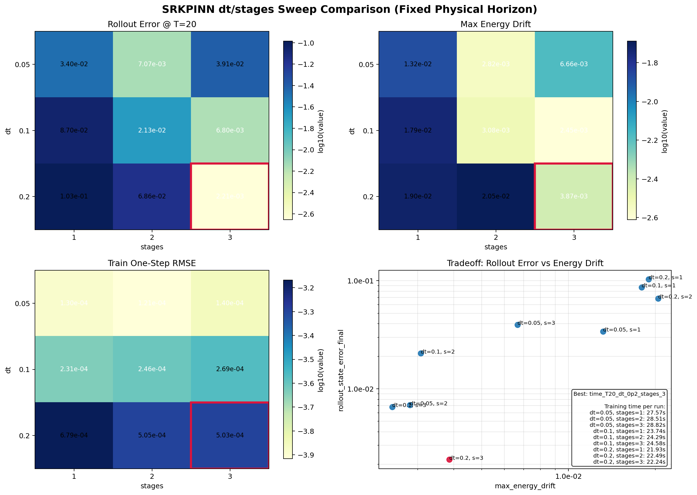
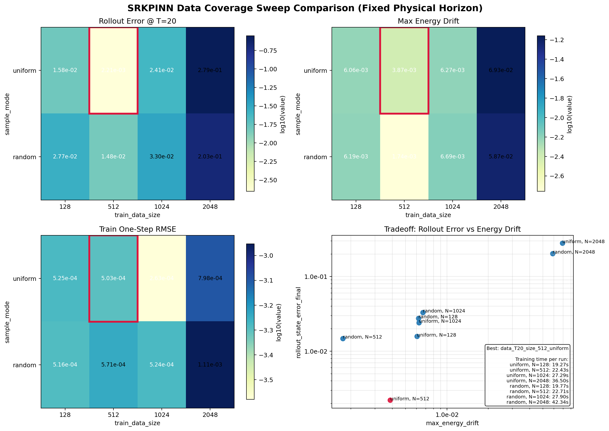
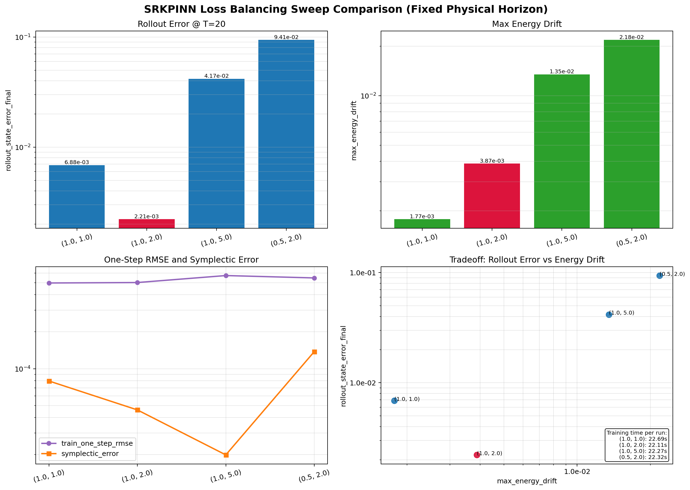
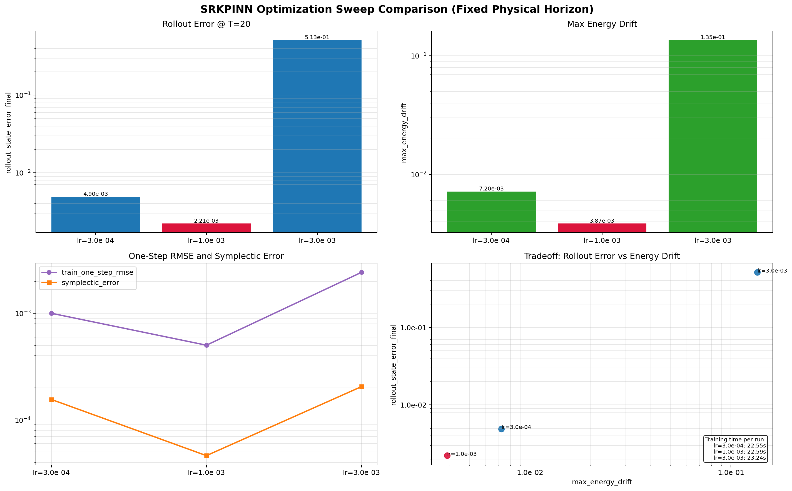
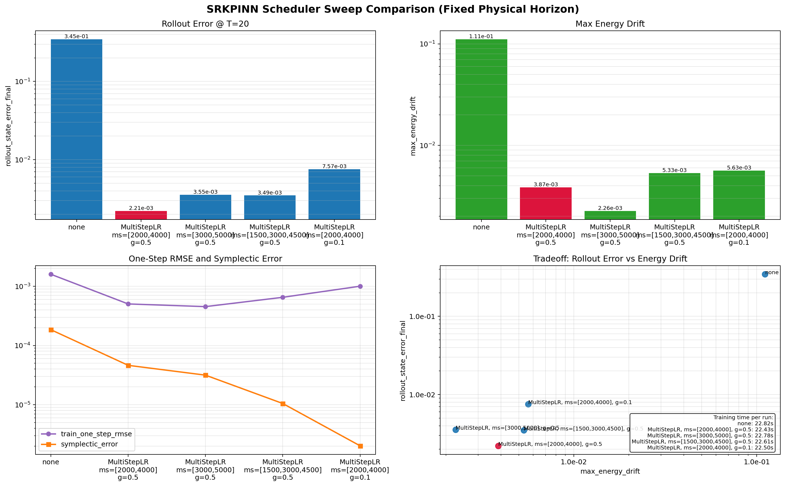
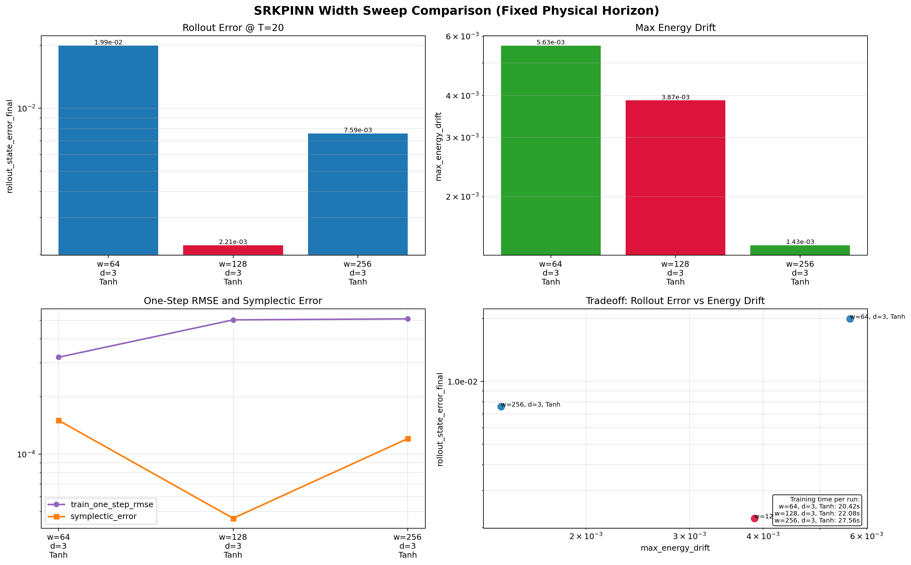
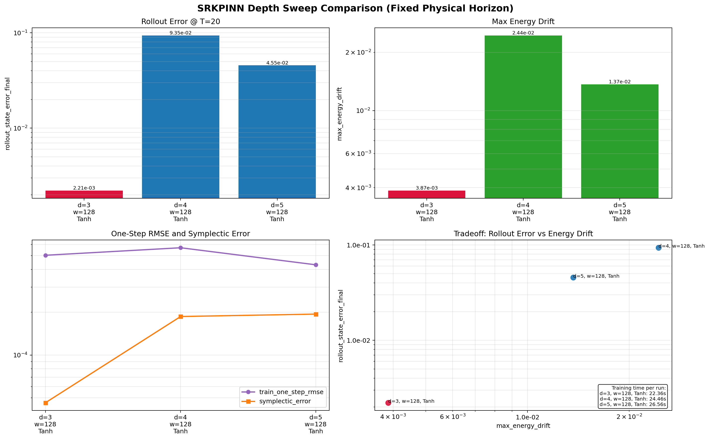
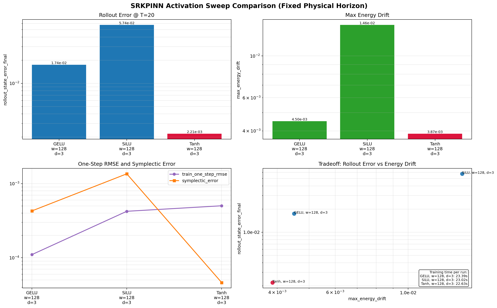

# SRKPINN Pendulum Sweep Final Summary

Generated on `2026-04-01`.

## Goal

This document closes the first coarse sweep cycle for the pendulum SRKPINN experiments under `app/piml/SRKPINN/experiment/`.

The main goal was to identify a configuration that improves long-rollout behavior at a fixed physical horizon, instead of over-optimizing one-step prediction only.

## Evaluation Protocol

- problem: pendulum SRKPINN
- coarse-sweep seed: `2026`
- common rollout horizon for fair comparison: `T_eval = 20.0`
- main ranking rule:
  `rollout_state_error_final`, then `max_energy_drift`, then `train_one_step_rmse`
- baseline reference:
  `baseline_v1` in `baseline/`

## Final Best Configuration

| Parameter | Value |
| --- | --- |
| `dt` | `0.2` |
| `stages` | `3` |
| method | `gauss-legendre` |
| `train_data_size` | `512` |
| `sample_mode` | `uniform` |
| loss weights | `StageDynamics=1.0`, `InitialOrData=2.0` |
| learning rate | `1e-3` |
| scheduler | `MultiStepLR milestones=[2000, 4000], gamma=0.5` |
| layers | `[2, 128, 128, 128, 6]` |
| activation | `Tanh` |

The final best run is `act_T20_lr_1em03_ep_6000_w_128_d_3_tanh`.

## Baseline vs Final Best

The baseline run `baseline_v1` used `dt=0.1`, `stages=2`, and `200` rollout steps. Since `0.1 x 200 = 20.0`, it is directly comparable to the final best run under the same physical horizon.

| Metric | Baseline | Final Best | Change |
| --- | --- | --- | --- |
| train one-step RMSE | `2.460166e-04` | `5.028848e-04` | worse `+104.4%` |
| rollout final error | `2.127771e-02` | `2.214470e-03` | better `-89.6%` |
| max rollout error | `2.127771e-02` | `4.014834e-03` | better `-81.1%` |
| final energy drift | `2.501249e-03` | `2.409577e-03` | better `-3.7%` |
| max energy drift | `3.078938e-03` | `3.867388e-03` | worse `+25.6%` |
| symplectic error | `1.908541e-04` | `4.625320e-05` | better `-75.8%` |
| training time | `23.71 s` | `22.63 s` | faster `-4.6%` |

Interpretation:

- The sweep delivered a large improvement in long-rollout accuracy.
- The gain did not come from lower one-step RMSE.
- The best coarse setting is therefore a better rollout model, not a better one-step regressor.

## Sweep Decisions

### 1. Time Discretization

Decision:

- best pair: `dt=0.2`, `stages=3`, `method=gauss-legendre`
- this was the highest-leverage change in the whole sweep
- it replaced the original baseline discretization `dt=0.1`, `stages=2`

Details:

- summary: [time_discretization/aggregate_summary_fixed_time_T20.md](time_discretization/aggregate_summary_fixed_time_T20.md)
- panel montage: [time_discretization/comparison_panels_fixed_time_T20.png](time_discretization/comparison_panels_fixed_time_T20.png)

### 2. Data Coverage

Decision:

- best pair: `train_data_size=512`, `sample_mode=uniform`
- increasing data beyond `512` hurt rollout behavior and increased runtime
- `random` sampling at `512` improved energy drift but lost on the primary rollout metric

Details:

- summary: [data_coverage/aggregate_summary_fixed_time_T20.md](data_coverage/aggregate_summary_fixed_time_T20.md)
- panel montage: [data_coverage/comparison_panels_fixed_time_T20.png](data_coverage/comparison_panels_fixed_time_T20.png)

### 3. Loss Balancing

Decision:

- best pair stayed at `StageDynamics=1.0`, `InitialOrData=2.0`
- the original loss balance was already near-optimal for this ranking rule

Details:

- summary: [loss_balancing/aggregate_summary_fixed_time_T20.md](loss_balancing/aggregate_summary_fixed_time_T20.md)
- panel montage: [loss_balancing/comparison_panels_fixed_time_T20.png](loss_balancing/comparison_panels_fixed_time_T20.png)

### 4. Optimization: Learning Rate

Decision:

- best learning rate: `1e-3`
- `3e-4` was smoother but not better on rollout
- `3e-3` was clearly unstable

Details:

- summary: [optimization/aggregate_summary_fixed_time_T20.md](optimization/aggregate_summary_fixed_time_T20.md)
- panel montage: [optimization/comparison_panels_fixed_time_T20.png](optimization/comparison_panels_fixed_time_T20.png)

### 5. Optimization: Scheduler

Decision:

- best scheduler stayed at `MultiStepLR milestones=[2000,4000], gamma=0.5`
- removing the scheduler caused a strong long-rollout regression
- a later decay schedule improved energy drift but still lost on rollout error

Details:

- summary: [optimization/scheduler_summary_fixed_time_T20.md](optimization/scheduler_summary_fixed_time_T20.md)
- panel montage: [optimization/comparison_panels_scheduler_fixed_time_T20.png](optimization/comparison_panels_scheduler_fixed_time_T20.png)

### 6. Network Capacity: Width

Decision:

- best width: `128`
- `64` underfit the rollout objective
- `256` improved energy drift but not enough to beat `128` on the main metric

Details:

- summary: [network_capacity/width_summary_fixed_time_T20.md](network_capacity/width_summary_fixed_time_T20.md)
- panel montage: [network_capacity/comparison_panels_width_fixed_time_T20.png](network_capacity/comparison_panels_width_fixed_time_T20.png)

### 7. Network Capacity: Depth

Decision:

- best depth: `3`
- `4` and `5` layers both caused severe long-rollout regressions

Details:

- summary: [network_capacity/depth_summary_fixed_time_T20.md](network_capacity/depth_summary_fixed_time_T20.md)
- panel montage: [network_capacity/comparison_panels_depth_fixed_time_T20.png](network_capacity/comparison_panels_depth_fixed_time_T20.png)

### 8. Network Capacity: Activation

Decision:

- best activation: `Tanh`
- `SiLU` and `GELU` both improved one-step RMSE
- neither beat `Tanh` on the primary rollout metric

Details:

- summary: [network_capacity/activation_summary_fixed_time_T20.md](network_capacity/activation_summary_fixed_time_T20.md)
- panel montage: [network_capacity/comparison_panels_activation_fixed_time_T20.png](network_capacity/comparison_panels_activation_fixed_time_T20.png)

## What Actually Mattered

- The decisive improvement came from the time discretization sweep.
- Data coverage and optimization tuning helped stabilize that choice, but did not overturn it.
- Coarse network-capacity sweeps did not beat the original `128 x 3, Tanh` backbone once rollout quality was used as the main objective.
- Several alternatives produced lower one-step RMSE while being materially worse for long-rollout dynamics.

## Final Conclusion

The first coarse sweep cycle is complete, and the best overall configuration is:

- `dt=0.2`
- `stages=3`
- `method=gauss-legendre`
- `train_data_size=512`
- `sample_mode=uniform`
- `StageDynamics=1.0`, `InitialOrData=2.0`
- `learning_rate=1e-3`
- `MultiStepLR milestones=[2000,4000], gamma=0.5`
- `layers=[2, 128, 128, 128, 6]`
- `activation=Tanh`

Relative to the baseline, this setting gives a much better long-rollout model at the same physical horizon, even though the one-step RMSE is worse.

## Recommended Follow-Up

- freeze the configuration above as the current reference model
- stop doing more coarse single-seed sweeps for now
- move to validation-oriented work:
  - several initial states
  - at least `3` seeds
  - longer rollout tests for the top `2` to `3` candidates
- only revisit longer training or alternate architectures if those validation passes expose a credible challenger
