# SRKPINN 摆系统参数扫描完整报告

基于 `app/piml/SRKPINN/experiment/` 目录下的实验产物整理生成。

本报告汇总了 `2026-04-01` 完成的摆系统 SRKPINN 全量参数扫描周期。报告不引入新实验，仅将现有的日志、摘要、图表及代码级实验细节重新组织为统一的交付文档。

## 0. 导读：SRKPINN 架构与 RKPINN 差异

在本轮摆系统实验中，`SRKPINN` 使用的是一个面向正则 Hamiltonian 系统的单步映射学习器。给定当前状态 `z_n = (q_n, p_n)`，骨干 `FNN` 只负责输出 `s` 个 RK 阶段状态 `(Q_i, P_i)`；模型随后结合经过辛条件验证的 Butcher 表，用硬编码的辛 RK 闭合公式重构 `z_{n+1}`，而不是再额外设置一个自由的终态输出头。也就是说，当前前向路径是“当前状态 -> 阶段变量 -> 由辛 RK 闭合得到下一步状态”，训练时再用 `StageDynamics` 与 `InitialOrData` 两项损失分别约束阶段一致性和单步数据拟合。需要注意的是，这一设计已经明显比通用 RK 风格回归器更保结构，但它仍不是精确辛映射，因为阶段方程目前仍通过损失软约束满足，而不是在前向中被精确求解。

与仓库中的原始 `RKPINN` 相比，当前 `SRKPINN` 的区别不只是“换了一套超参数”，而是问题类型与模型组织方式都发生了变化。原始 `RKPINN` 是面向一维电晕放电 PDE 的求解器，输入是空间坐标 `r`，输出是 `Phi`、`Ne` 在各个 RK 阶段的场值，训练目标主要由 PDE 残差和边界残差构成；当前 `SRKPINN` 则是面向 Hamiltonian ODE 的相空间单步模型，输入输出都发生在状态空间里，重点是利用辛 RK 结构改善长时间 rollout 的几何性质。因此，它更适合被理解为“保结构的 Hamiltonian 单步映射学习器”，而不是原始 `RKPINN` 在摆系统上的直接平移版本。更细的公式与实现细节见第 `3.2` 到 `3.4` 节。

| 维度 | 当前 `SRKPINN` | 原始 `RKPINN` |
| --- | --- | --- |
| 面向问题 | 正则 Hamiltonian ODE 单步映射 | 1D 电晕放电 PDE |
| 网络输入 | 当前状态 `z_n=(q_n,p_n)` | 空间坐标 `r` |
| 网络直接输出 | 仅 RK 阶段状态 `(Q_i,P_i)` | `Phi`、`Ne` 在 `q+1` 个 RK 阶段上的场值 |
| 步终状态处理 | 通过硬辛 RK 闭合公式重构 `z_{n+1}` | 最终阶段/终态属于网络自由输出的一部分 |
| 主要损失 | `StageDynamics` + `InitialOrData` | PDE 残差 + 边界残差（当前实现合并为 `Equ_all`） |
| RK 的角色 | 同时承担时间离散化与保结构约束 | 主要作为时间离散化工具 |
| 设计目标 | 改善长 rollout 下的能量与辛结构表现 | 满足 PDE 与边界条件、推进放电场演化 |

## 1. 总体摘要

- 首轮粗扫描周期已完成。
- 决定性的改进来源于时间离散化方案的选择，而非增大网络宽度、深度或平滑性。
- 在固定物理时域 `T_eval = 20` 的公平比较协议下，最优总体配置为：
  - `dt = 0.2`
  - `stages = 3`
  - `method = gauss-legendre`
  - `train_data_size = 512`
  - `sample_mode = uniform`
  - `StageDynamics = 1.0`
  - `InitialOrData = 2.0`
  - `learning_rate = 1e-3`
  - `scheduler = MultiStepLR milestones=[2000,4000], gamma=0.5`
  - `layers = [2, 128, 128, 128, 6]`
  - `activation = Tanh`
- 最终最优运行：`act_T20_lr_1em03_ep_6000_w_128_d_3_tanh`
- 相较于基线 `baseline_v1`，最终最优运行在相同物理时域下将 rollout 终端误差降低了 `89.6%`，尽管单步 RMSE 有所恶化。
- 粗架构扫描表明，在当前训练设置下，现有的 `HamiltonianSRKPINN` 骨干网络已接近饱和。进一步粗调宽度、深度和激活函数均未产生更优的长 rollout 模型。

## 2. 范围与运行统计

本仓库共包含 `49` 次已完成的运行，记录于 [SWEEP_LOG.md](SWEEP_LOG.md)：

| 运行组 | 完成次数 | 角色 |
| --- | ---: | --- |
| `baseline_v1` | `1` | 官方基线 |
| `baseline_smoke` | `1` | 冒烟测试 |
| `time_dt_*` | `9` | 历史固定 200 步跨 `dt` 扫描，仅作记录保留 |
| `time_T20_*` | `9` | 固定物理时域下的官方时间离散化扫描 |
| `data_T20_*` | `8` | 数据覆盖度扫描 |
| `loss_T20_*` | `4` | 损失权重平衡扫描 |
| `opt_T20_*` | `3` | 学习率扫描 |
| `sched_T20_*` | `5` | 学习率调度器扫描 |
| `width_T20_*` | `3` | 宽度扫描 |
| `depth_T20_*` | `3` | 深度扫描 |
| `act_T20_*` | `3` | 激活函数扫描 |

在正式的扫描决策中，本报告采用固定物理时域协议及 `39` 次决策运行：

- `baseline_v1`
- `time_T20_*`
- `data_T20_*`
- `loss_T20_*`
- `opt_T20_*`
- `sched_T20_*`
- `width_T20_*`
- `depth_T20_*`
- `act_T20_*`

早期固定 `200` 步的 `dt x stages` 比较仅作为方法论历史注记保留，因其在不同 `dt` 下比较了不同的物理 rollout 时长。

## 3. 问题定义、模型与共享协议

### 3.1 问题定义

基准系统为非线性摆：

```math
H(q,p) = \frac{1}{2}p^2 + \omega_0^2(1 - \cos q),
```

其正则动力学方程为

```math
\dot q = \nabla_p H(q,p), \qquad \dot p = -\nabla_q H(q,p).
```

共享系统设置：

- `omega0 = 1.0`
- 状态维度 `state_dim = 2`
- 训练域：
  - `q in [-pi, pi]`
  - `p in [-2, 2]`

### 3.2 当前 SRKPINN 架构

当前模型类为 `HamiltonianSRKPINN`，实现于 [model.py](../../../../SRKPINN/model.py)。其骨干为标准前馈网络 `FNN`，由 [networks.py](../../../../SRKPINN/networks.py) 中的 `HamiltonianSRKNet` 封装。

核心设计如下：

- 网络仅预测 RK stage 状态
- 步终状态通过硬辛 RK 闭合条件重构
- 不存在 `(q_{n+1}, p_{n+1})` 的自由输出头

对于 `s`-stage 方法和摆系统 `state_dim = 2`：

- 骨干输入维度：`2`
- 骨干输出维度：`2 * stages`
- 前 `stages` 个标量对应 `q`-stage 值
- 后 `stages` 个标量对应 `p`-stage 值

学习到的 stage 状态为：

```math
(Q_1, P_1), \dots, (Q_s, P_s).
```

损失函数中强制满足的 stage 残差为：

```math
R^Q_i = Q_i - q_n - \Delta t \sum_j a_{ij}\nabla_p H(Q_j, P_j),
```

```math
R^P_i = P_i - p_n + \Delta t \sum_j a_{ij}\nabla_q H(Q_j, P_j).
```

硬步终闭合条件为：

```math
q_{n+1} = q_n + \Delta t \sum_i b_i \nabla_p H(Q_i, P_i),
```

```math
p_{n+1} = p_n - \Delta t \sum_i b_i \nabla_q H(Q_i, P_i).
```

### 3.3 训练目标与数据构造

每次运行基于单步监督对进行训练

```math
(z_n, z_{n+1}^{ref}).
```

当未预先提供 `train_data` 时：

1. 通过 `PendulumSystem.sample_initial_states` 采样初始状态
2. 由参考积分器生成单步目标
3. 生成的数据对张量在该次运行中固定不变

重要细节：

- `sample_mode = uniform` 在相空间中生成网格并截断至请求数量
- `sample_mode = random` 在相空间盒中进行独立同分布均匀采样
- 参考积分器为 `SciPy solve_ivp(method="DOP853")`
- 容差设置为 `rtol = 1e-10`、`atol = 1e-10`
- 每次运行重新生成数据集

### 3.4 损失项

总损失为

```math
\mathcal{L}
= w_{stage} \cdot \mathrm{MSE}(R^{stage})
+ w_{data} \cdot \mathrm{MSE}(R^{data}),
```

其中

```math
R^{data} = z_{n+1}^{SRK}(Q,P) - z_{n+1}^{ref}.
```

活跃的损失分量为：

- `StageDynamics`
- `InitialOrData`

基线损失权重为：

- `StageDynamics = 1.0`
- `InitialOrData = 2.0`

### 3.5 共享训练与评估协议

粗扫描周期中的共享约定：

- 粗扫描种子：`2026`
- 优化器族：`Adam`
- 默认调度器族：`MultiStepLR`
- 容量扫描前的默认隐层宽度/深度：`128 x 3`
- 激活函数扫描前的默认激活函数：`Tanh`
- 诊断用监测 rollout 种子：`[1.7, 0.0]`
- 运行器设备策略：`CUDA > MPS > CPU`
- 摘要中记录的代表性运行使用了 `cpu`

主要评估指标：

- `train_one_step_rmse`（训练单步 RMSE）
- `rollout_state_error_final`（rollout 终端状态误差）
- `max_rollout_state_error`（最大 rollout 状态误差）
- `energy_drift_final`（终端能量漂移）
- `max_energy_drift`（最大能量漂移）
- `symplectic_error`（辛误差）
- `training_time_sec`（训练时间）

主要排序规则：

1. `rollout_state_error_final`（rollout 终端状态误差）
2. `max_energy_drift`（最大能量漂移）
3. `train_one_step_rmse`（训练单步 RMSE）

跨 `dt` 公平比较规则：

- 在固定物理时域 `T_eval = 20.0` 下进行比较
- 通过 `num_steps = round(T_eval / dt)` 将 rollout 步数从 `dt` 转换

### 3.6 产物目录结构

每次运行生成：

- `config.json`
- `summary.json`
- `summary.md`
- `results/final_panels.png`
- `results/loss_curve.png`
- `runs/`
- `models/`

全局摘要和扫描图表位于：

- [time_discretization/](time_discretization/)
- [data_coverage/](data_coverage/)
- [loss_balancing/](loss_balancing/)
- [optimization/](optimization/)
- [network_capacity/](network_capacity/)

## 4. 搜索空间概览

| 扫描组 | 固定设置 | 扫描设置 | 选定设置 |
| --- | --- | --- | --- |
| Baseline | 原始摆脚本配置 | 无 | `dt=0.1`, `stages=2`, `[2,128,128,128,4]`, `Tanh` |
| 时间离散化 | 基线训练/数据/损失设置 | `dt in {0.05, 0.1, 0.2}`, `stages in {1,2,3}` | `dt=0.2`, `stages=3` |
| 数据覆盖度 | `dt=0.2`, `stages=3` | `train_data_size in {128,512,1024,2048}`, `sample_mode in {uniform,random}` | `512`, `uniform` |
| 损失权重平衡 | 最优离散化 + 数据设置 | `(StageDynamics, InitialOrData) in {(1,1),(1,2),(1,5),(0.5,2)}` | `(1.0, 2.0)` |
| 优化：学习率 | 最优离散化 + 数据 + 损失设置 | `lr in {3e-4, 1e-3, 3e-3}`, `epochs=6000` | `1e-3` |
| 优化：调度器 | `lr=1e-3` | `none`、若干 `MultiStepLR` 变体 | `milestones=[2000,4000], gamma=0.5` |
| 容量：宽度 | 最优优化设置, depth=`3`, act=`Tanh` | `width in {64,128,256}` | `128` |
| 容量：深度 | width=`128`, act=`Tanh` | `depth in {3,4,5}` | `3` |
| 容量：激活函数 | width=`128`, depth=`3` | `Tanh`, `SiLU`, `GELU` | `Tanh` |

## 5. 基线运行

基线运行：`baseline_v1`

### 5.1 配置

| 项目 | 值 |
| --- | --- |
| 种子 | `2026` |
| `dt` | `0.1` |
| `stages` | `2` |
| 方法 | `gauss-legendre` |
| `train_data_size` | `512` |
| `sample_mode` | `uniform` |
| 损失权重 | `StageDynamics=1.0`, `InitialOrData=2.0` |
| 网络层 | `[2, 128, 128, 128, 4]` |
| 激活函数 | `Tanh` |
| 优化器 | `Adam(lr=1e-3)` |
| 调度器 | `MultiStepLR milestones=[2000,4000], gamma=0.5` |
| 训练轮数 | `6000` |
| 评估 rollout | `200` 步, `T=20.0` |

### 5.2 基线指标

| 指标 | 值 |
| --- | ---: |
| 训练单步 RMSE | `2.460166e-04` |
| 监测单步 L2 | `4.101774e-05` |
| rollout 状态误差 @ `T=20` | `2.127771e-02` |
| 最大 rollout 状态误差 | `2.127771e-02` |
| 终端能量漂移 @ `T=20` | `2.501249e-03` |
| 最大能量漂移 | `3.078938e-03` |
| 辛误差 | `1.908541e-04` |
| 训练时间 | `23.71 s` |

### 5.3 基线诊断图


## 6. 扫描涵盖的模型架构变体

### 6.1 离散化驱动的输出形状

由于摆系统 `state_dim = 2`，骨干输出维度为 `2 * stages`。

| `stages` | 扫描中使用的方法族 | 网络层 |
| --- | --- | --- |
| `1` | `implicit-midpoint` | `[2, 128, 128, 128, 2]` |
| `2` | `gauss-legendre` | `[2, 128, 128, 128, 4]` |
| `3` | `gauss-legendre` | `[2, 128, 128, 128, 6]` |

### 6.2 宽度变体

| 宽度 | 网络层 | 激活函数 |
| --- | --- | --- |
| `64` | `[2, 64, 64, 64, 6]` | `Tanh` |
| `128` | `[2, 128, 128, 128, 6]` | `Tanh` |
| `256` | `[2, 256, 256, 256, 6]` | `Tanh` |

### 6.3 深度变体

| 深度 | 网络层 | 激活函数 |
| --- | --- | --- |
| `3` | `[2, 128, 128, 128, 6]` | `Tanh` |
| `4` | `[2, 128, 128, 128, 128, 6]` | `Tanh` |
| `5` | `[2, 128, 128, 128, 128, 128, 6]` | `Tanh` |

### 6.4 激活函数变体

| 激活函数 | 网络层 |
| --- | --- |
| `Tanh` | `[2, 128, 128, 128, 6]` |
| `SiLU` | `[2, 128, 128, 128, 6]` |
| `GELU` | `[2, 128, 128, 128, 6]` |

## 7. 扫描结果

### 7.1 时间离散化扫描

协议：

- 在固定物理时域 `T_eval = 20.0` 下比较 `dt x stages`
- `stages=1` 使用 `implicit-midpoint`
- `stages >= 2` 使用 `gauss-legendre`

结果：

| 运行名称 | `dt` | `stages` | 方法 | rollout 步数 | 训练单步 RMSE | rollout 终端误差 | 最大 rollout 误差 | 终端能量漂移 | 最大能量漂移 | 辛误差 | 训练时间 (s) |
| --- | ---: | ---: | --- | ---: | ---: | ---: | ---: | ---: | ---: | ---: | ---: |
| `time_T20_dt_0p05_stages_1` | `0.05` | `1` | `implicit-midpoint` | `400` | `1.302531e-04` | `3.396456e-02` | `3.396456e-02` | `1.319385e-02` | `1.319385e-02` | `6.002188e-05` | `27.57` |
| `time_T20_dt_0p05_stages_2` | `0.05` | `2` | `gauss-legendre` | `400` | `1.212551e-04` | `7.065535e-03` | `8.742251e-03` | `7.638931e-04` | `2.822399e-03` | `1.323223e-04` | `28.51` |
| `time_T20_dt_0p05_stages_3` | `0.05` | `3` | `gauss-legendre` | `400` | `1.401090e-04` | `3.912516e-02` | `3.912516e-02` | `6.626725e-03` | `6.663918e-03` | `3.993511e-05` | `28.82` |
| `time_T20_dt_0p1_stages_1` | `0.1` | `1` | `implicit-midpoint` | `200` | `2.310528e-04` | `8.702857e-02` | `8.702857e-02` | `1.702070e-02` | `1.794302e-02` | `9.006262e-05` | `23.74` |
| `time_T20_dt_0p1_stages_2` | `0.1` | `2` | `gauss-legendre` | `200` | `2.460166e-04` | `2.127771e-02` | `2.127771e-02` | `2.501249e-03` | `3.078938e-03` | `1.908541e-04` | `24.29` |
| `time_T20_dt_0p1_stages_3` | `0.1` | `3` | `gauss-legendre` | `200` | `2.687145e-04` | `6.799262e-03` | `8.960553e-03` | `1.523972e-03` | `2.448559e-03` | `1.263618e-05` | `24.58` |
| `time_T20_dt_0p2_stages_1` | `0.2` | `1` | `implicit-midpoint` | `100` | `6.788900e-04` | `1.032801e-01` | `1.032801e-01` | `1.856148e-02` | `1.896358e-02` | `1.309514e-04` | `21.93` |
| `time_T20_dt_0p2_stages_2` | `0.2` | `2` | `gauss-legendre` | `100` | `5.047846e-04` | `6.858048e-02` | `6.858048e-02` | `2.045274e-02` | `2.045274e-02` | `4.019737e-04` | `22.49` |
| `time_T20_dt_0p2_stages_3` | `0.2` | `3` | `gauss-legendre` | `100` | `5.028848e-04` | `2.214470e-03` | `4.014834e-03` | `2.409577e-03` | `3.867388e-03` | `4.625320e-05` | `22.24` |

决策结论：

- 最优组合：`dt=0.2`, `stages=3`, `method=gauss-legendre`
- 这是整个扫描周期中杠杆效应最大的变更
- 早期固定 `200` 步的比较错误地偏向了较小的 `dt`

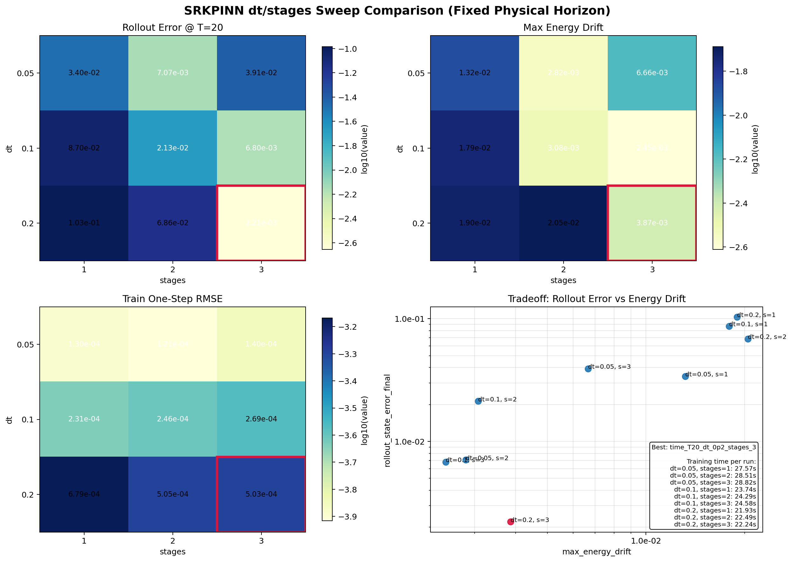

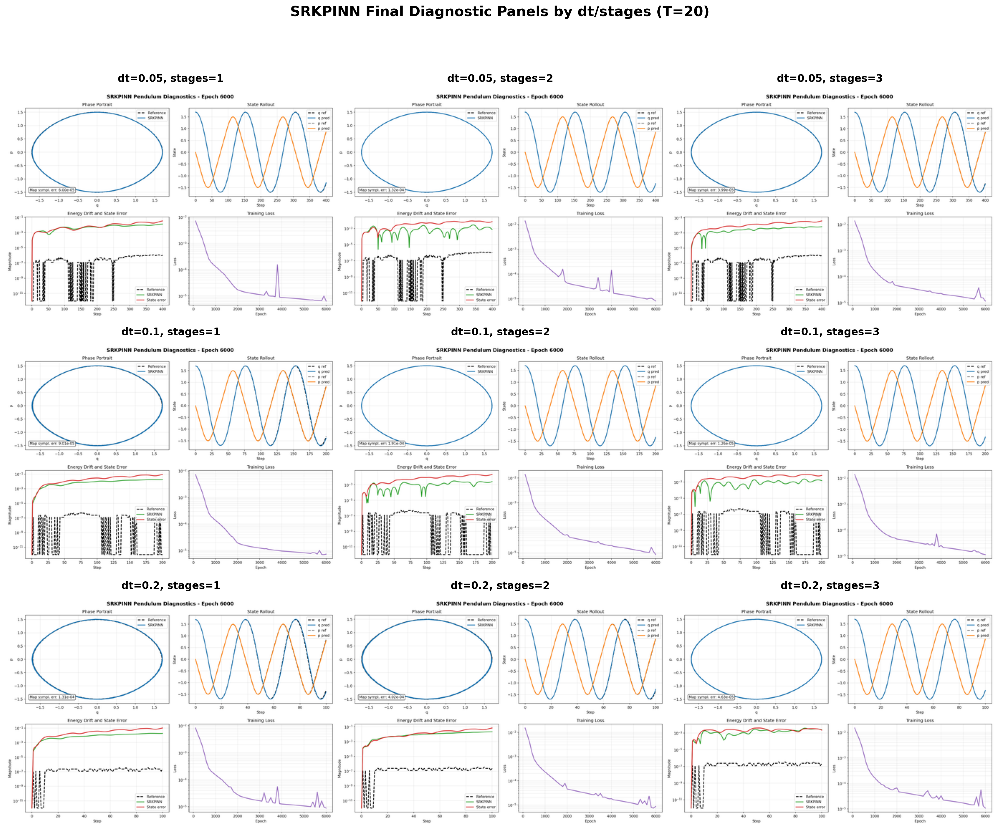

### 7.2 数据覆盖度扫描

固定设置：

- `dt=0.2`
- `stages=3`
- `method=gauss-legendre`
- 固定 rollout 时域 `T_eval=20.0`

结果：

| 运行名称 | 训练数据量 | 采样模式 | 训练单步 RMSE | rollout 终端误差 | 最大 rollout 误差 | 终端能量漂移 | 最大能量漂移 | 辛误差 | 训练时间 (s) |
| --- | ---: | --- | ---: | ---: | ---: | ---: | ---: | ---: | ---: |
| `data_T20_size_128_uniform` | `128` | `uniform` | `5.246736e-04` | `1.580316e-02` | `1.580316e-02` | `5.020857e-03` | `6.056905e-03` | `1.213551e-04` | `19.27` |
| `data_T20_size_512_uniform` | `512` | `uniform` | `5.028848e-04` | `2.214470e-03` | `4.014834e-03` | `2.409577e-03` | `3.867388e-03` | `4.625320e-05` | `22.43` |
| `data_T20_size_1024_uniform` | `1024` | `uniform` | `2.633082e-04` | `2.407603e-02` | `2.407603e-02` | `6.265640e-03` | `6.265640e-03` | `3.892183e-05` | `27.29` |
| `data_T20_size_2048_uniform` | `2048` | `uniform` | `7.981696e-04` | `2.794093e-01` | `2.794093e-01` | `6.925547e-02` | `6.925547e-02` | `2.400875e-04` | `36.50` |
| `data_T20_size_128_random` | `128` | `random` | `5.158094e-04` | `2.765654e-02` | `2.765654e-02` | `6.191492e-03` | `6.191492e-03` | `3.324151e-04` | `19.77` |
| `data_T20_size_512_random` | `512` | `random` | `5.714895e-04` | `1.484200e-02` | `1.484200e-02` | `1.396418e-03` | `1.742840e-03` | `1.543760e-04` | `22.71` |
| `data_T20_size_1024_random` | `1024` | `random` | `5.235816e-04` | `3.300342e-02` | `3.300342e-02` | `6.686926e-03` | `6.686926e-03` | `1.775026e-04` | `27.90` |
| `data_T20_size_2048_random` | `2048` | `random` | `1.112499e-03` | `2.030560e-01` | `2.030560e-01` | `5.871272e-02` | `5.871272e-02` | `6.459355e-04` | `42.34` |

决策结论：

- 最优组合：`train_data_size=512`, `sample_mode=uniform`
- 数据量超过 `512` 后，长 rollout 表现反而退化，且运行时间增加
- `512 random` 改善了能量漂移，但在主要 rollout 指标上仍不及 uniform

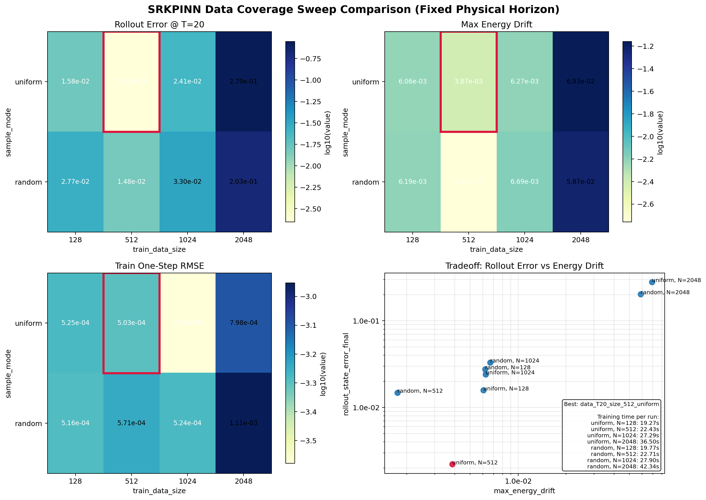

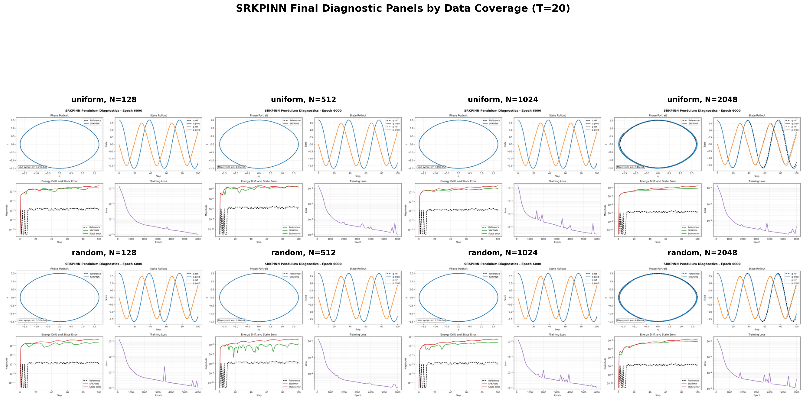

### 7.3 损失权重平衡扫描

固定设置：

- `dt=0.2`
- `stages=3`
- `train_data_size=512`
- `sample_mode=uniform`
- `T_eval=20.0`

结果：

| 运行名称 | 损失权重 | 训练单步 RMSE | rollout 终端误差 | 最大 rollout 误差 | 终端能量漂移 | 最大能量漂移 | 辛误差 | 训练时间 (s) |
| --- | --- | ---: | ---: | ---: | ---: | ---: | ---: | ---: |
| `loss_T20_stage_1p0_data_1p0` | `StageDynamics=1.0, InitialOrData=1.0` | `4.987519e-04` | `6.875421e-03` | `8.519171e-03` | `5.283356e-04` | `1.774549e-03` | `7.951260e-05` | `22.69` |
| `loss_T20_stage_1p0_data_2p0` | `StageDynamics=1.0, InitialOrData=2.0` | `5.028848e-04` | `2.214470e-03` | `4.014834e-03` | `2.409577e-03` | `3.867388e-03` | `4.625320e-05` | `22.11` |
| `loss_T20_stage_1p0_data_5p0` | `StageDynamics=1.0, InitialOrData=5.0` | `5.732490e-04` | `4.169866e-02` | `4.169866e-02` | `1.002181e-02` | `1.349068e-02` | `1.990795e-05` | `22.27` |
| `loss_T20_stage_0p5_data_2p0` | `StageDynamics=0.5, InitialOrData=2.0` | `5.482921e-04` | `9.407885e-02` | `9.407885e-02` | `2.183402e-02` | `2.183402e-02` | `1.378059e-04` | `22.32` |

决策结论：

- 最优组合仍为 `StageDynamics=1.0`, `InitialOrData=2.0`
- 原始损失权重在所选排序规则下已接近最优

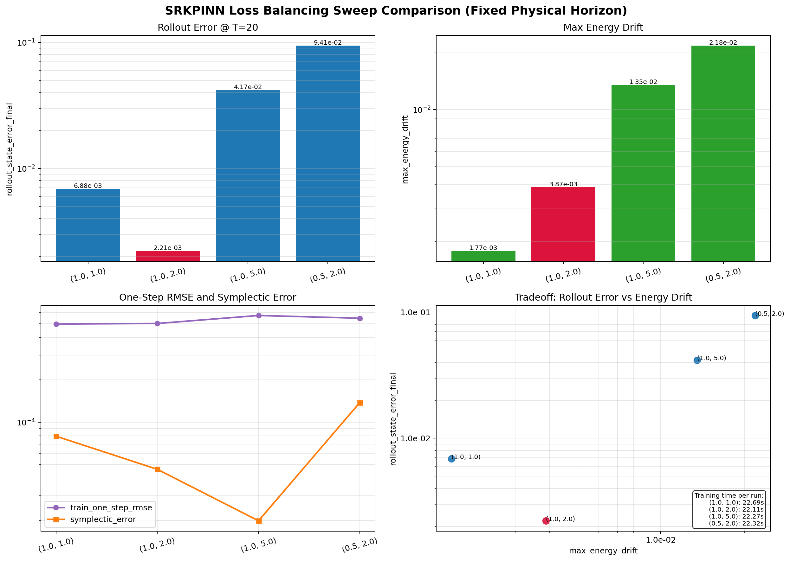

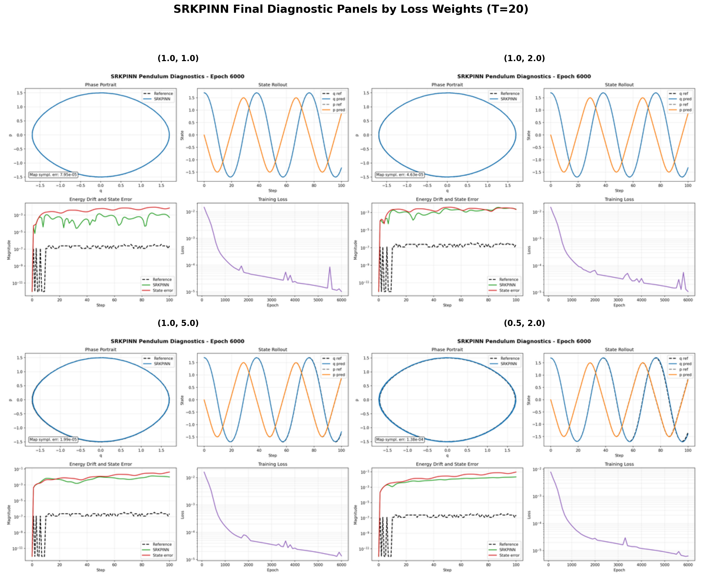

### 7.4 优化扫描：学习率

固定设置：

- `dt=0.2`
- `stages=3`
- `train_data_size=512`
- `sample_mode=uniform`
- 损失权重 `1.0 / 2.0`
- 调度器 `MultiStepLR milestones=[2000,4000], gamma=0.5`
- 训练轮数 `6000`

结果：

| 运行名称 | 学习率 | 训练单步 RMSE | rollout 终端误差 | 最大 rollout 误差 | 终端能量漂移 | 最大能量漂移 | 辛误差 | 训练时间 (s) |
| --- | ---: | ---: | ---: | ---: | ---: | ---: | ---: | ---: |
| `opt_T20_lr_3em04_ep_6000_multisteplr` | `3e-4` | `1.002758e-03` | `4.904904e-03` | `1.136551e-02` | `5.658269e-03` | `7.202148e-03` | `1.558065e-04` | `22.55` |
| `opt_T20_lr_1em03_ep_6000_multisteplr` | `1e-3` | `5.028848e-04` | `2.214470e-03` | `4.014834e-03` | `2.409577e-03` | `3.867388e-03` | `4.625320e-05` | `22.59` |
| `opt_T20_lr_3em03_ep_6000_multisteplr` | `3e-3` | `2.429325e-03` | `5.129830e-01` | `5.129830e-01` | `1.353902e-01` | `1.353902e-01` | `2.056360e-04` | `23.24` |

决策结论：

- 最优学习率：`1e-3`
- `3e-4` 训练更平稳但 rollout 表现仍不及最优
- `3e-3` 明显不稳定

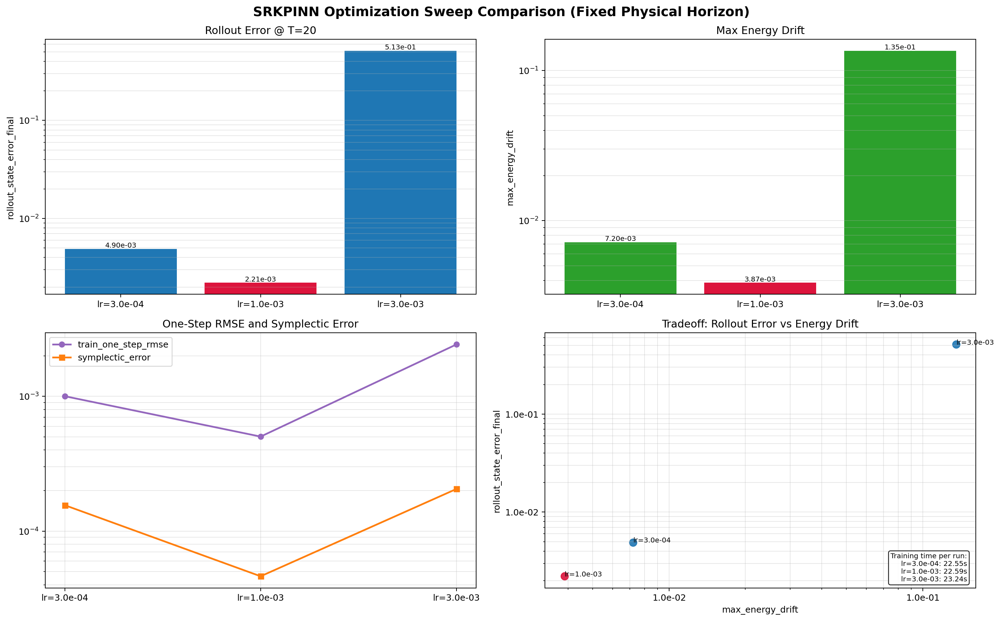

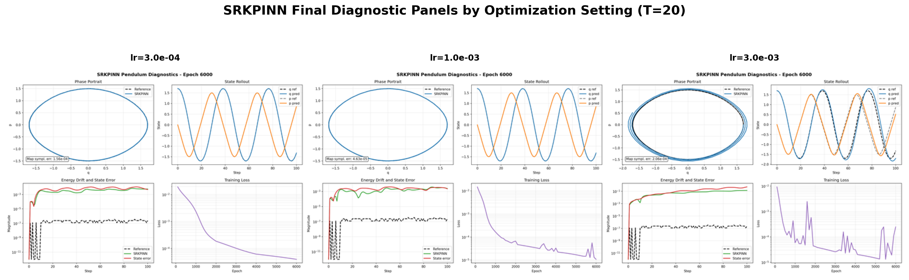

### 7.5 优化扫描：调度器

固定设置：

- `dt=0.2`
- `stages=3`
- `train_data_size=512`
- `sample_mode=uniform`
- 损失权重 `1.0 / 2.0`
- 学习率 `1e-3`
- 训练轮数 `6000`

结果：

| 运行名称 | 调度器 | 训练单步 RMSE | rollout 终端误差 | 最大 rollout 误差 | 终端能量漂移 | 最大能量漂移 | 辛误差 | 训练时间 (s) |
| --- | --- | ---: | ---: | ---: | ---: | ---: | ---: | ---: |
| `sched_T20_lr_1em03_ep_6000_none` | `none` | `1.593060e-03` | `3.448007e-01` | `3.448007e-01` | `1.108930e-01` | `1.108930e-01` | `1.848340e-04` | `22.82` |
| `sched_T20_lr_1em03_ep_6000_multisteplr_ms_2000_4000_g_0p5` | `MultiStepLR milestones=[2000,4000], gamma=0.5` | `5.028848e-04` | `2.214470e-03` | `4.014834e-03` | `2.409577e-03` | `3.867388e-03` | `4.625320e-05` | `22.43` |
| `sched_T20_lr_1em03_ep_6000_multisteplr_ms_3000_5000_g_0p5` | `MultiStepLR milestones=[3000,5000], gamma=0.5` | `4.531003e-04` | `3.548978e-03` | `5.375472e-03` | `7.886887e-04` | `2.259731e-03` | `3.159046e-05` | `22.78` |
| `sched_T20_lr_1em03_ep_6000_multisteplr_ms_1500_3000_4500_g_0p5` | `MultiStepLR milestones=[1500,3000,4500], gamma=0.5` | `6.510011e-04` | `3.488601e-03` | `6.418322e-03` | `4.249096e-03` | `5.326271e-03` | `1.049042e-05` | `22.61` |
| `sched_T20_lr_1em03_ep_6000_multisteplr_ms_2000_4000_g_0p1` | `MultiStepLR milestones=[2000,4000], gamma=0.1` | `1.001879e-03` | `7.565309e-03` | `1.354829e-02` | `4.773140e-03` | `5.630016e-03` | `2.026558e-06` | `22.50` |

决策结论：

- 最优调度器仍为 `MultiStepLR milestones=[2000,4000], gamma=0.5`
- 移除调度器严重损害了长 rollout 性能
- 延后衰减方案改善了能量漂移，但在主要 rollout 指标上仍不及最优

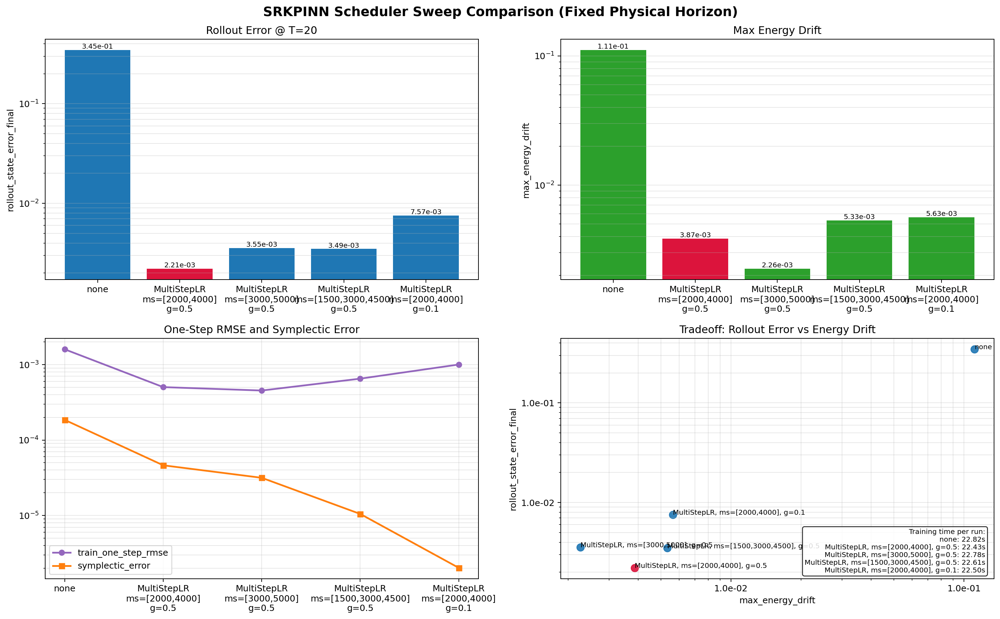

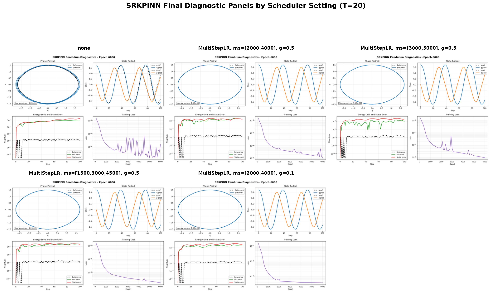

### 7.6 网络容量扫描：宽度

固定设置：

- `dt=0.2`
- `stages=3`
- `train_data_size=512`
- `sample_mode=uniform`
- 损失权重 `1.0 / 2.0`
- `learning_rate=1e-3`
- `epochs=6000`
- `scheduler=MultiStepLR milestones=[2000,4000], gamma=0.5`
- 深度 `3`
- 激活函数 `Tanh`

结果：

| 运行名称 | 宽度 | 网络层 | 训练单步 RMSE | rollout 终端误差 | 最大 rollout 误差 | 终端能量漂移 | 最大能量漂移 | 辛误差 | 训练时间 (s) |
| --- | ---: | --- | ---: | ---: | ---: | ---: | ---: | ---: | ---: |
| `width_T20_lr_1em03_ep_6000_w_64_d_3_tanh` | `64` | `[2, 64, 64, 64, 6]` | `3.208517e-04` | `1.993498e-02` | `1.993498e-02` | `5.625248e-03` | `5.625248e-03` | `1.501441e-04` | `20.42` |
| `width_T20_lr_1em03_ep_6000_w_128_d_3_tanh` | `128` | `[2, 128, 128, 128, 6]` | `5.028848e-04` | `2.214470e-03` | `4.014834e-03` | `2.409577e-03` | `3.867388e-03` | `4.625320e-05` | `22.08` |
| `width_T20_lr_1em03_ep_6000_w_256_d_3_tanh` | `256` | `[2, 256, 256, 256, 6]` | `5.090443e-04` | `7.593290e-03` | `8.909126e-03` | `1.433611e-03` | `1.433611e-03` | `1.205206e-04` | `27.56` |

决策结论：

- 最优宽度：`128`
- 宽度 `64` 在 rollout 目标上欠拟合
- 宽度 `256` 改善了能量漂移，但不足以在 rollout 误差上超越 `128`

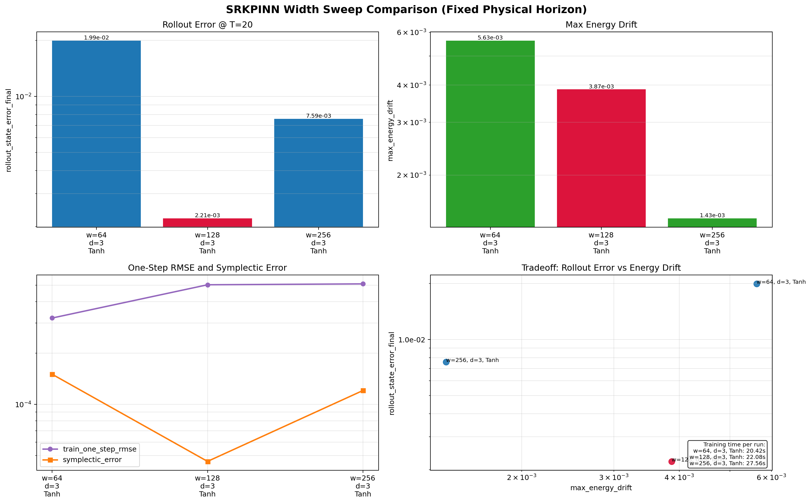

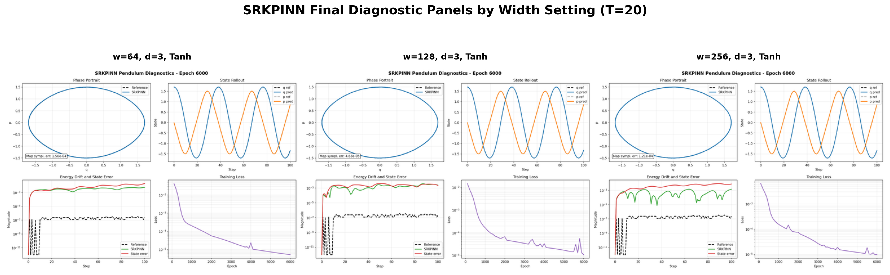

### 7.7 网络容量扫描：深度

固定设置：

- 宽度 `128`
- 激活函数 `Tanh`
- 其余设置均固定为已选定的优化配置

结果：

| 运行名称 | 深度 | 网络层 | 训练单步 RMSE | rollout 终端误差 | 最大 rollout 误差 | 终端能量漂移 | 最大能量漂移 | 辛误差 | 训练时间 (s) |
| --- | ---: | --- | ---: | ---: | ---: | ---: | ---: | ---: | ---: |
| `depth_T20_lr_1em03_ep_6000_w_128_d_3_tanh` | `3` | `[2, 128, 128, 128, 6]` | `5.028848e-04` | `2.214470e-03` | `4.014834e-03` | `2.409577e-03` | `3.867388e-03` | `4.625320e-05` | `22.36` |
| `depth_T20_lr_1em03_ep_6000_w_128_d_4_tanh` | `4` | `[2, 128, 128, 128, 128, 6]` | `5.678518e-04` | `9.351863e-02` | `9.351863e-02` | `2.440393e-02` | `2.440393e-02` | `1.866221e-04` | `24.46` |
| `depth_T20_lr_1em03_ep_6000_w_128_d_5_tanh` | `5` | `[2, 128, 128, 128, 128, 128, 6]` | `4.309793e-04` | `4.551701e-02` | `4.551701e-02` | `1.366103e-02` | `1.366103e-02` | `1.940727e-04` | `26.56` |

决策结论：

- 最优深度：`3`
- 更深的网络在部分情况下降低了单步 RMSE，但导致了严重的长 rollout 退化

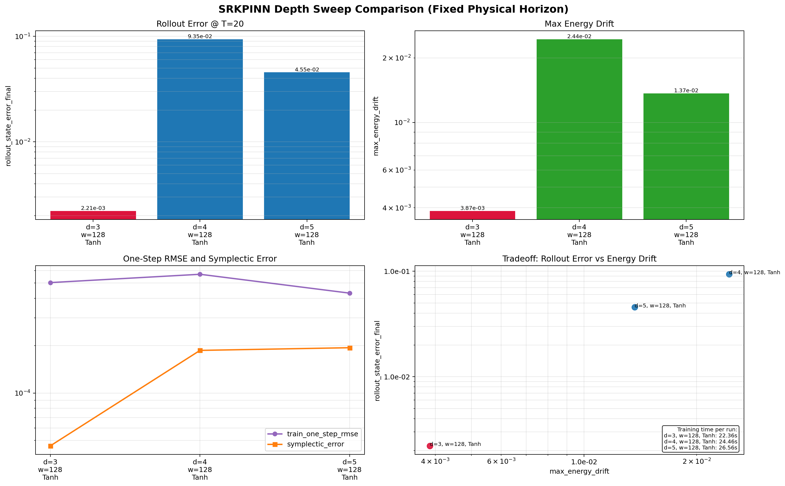

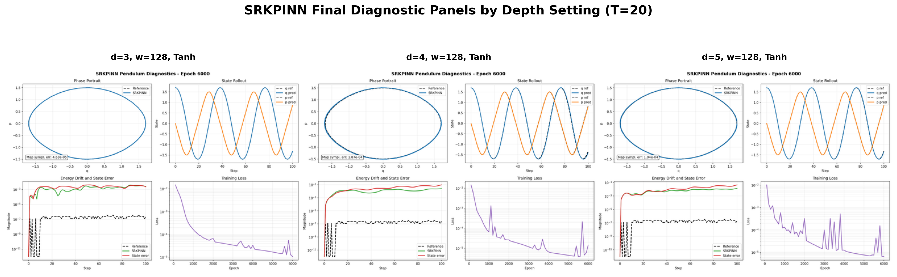

### 7.8 网络容量扫描：激活函数

固定设置：

- 宽度 `128`
- 深度 `3`
- 其余设置均固定为已选定的优化配置

结果：

| 运行名称 | 激活函数 | 网络层 | 训练单步 RMSE | rollout 终端误差 | 最大 rollout 误差 | 终端能量漂移 | 最大能量漂移 | 辛误差 | 训练时间 (s) |
| --- | --- | --- | ---: | ---: | ---: | ---: | ---: | ---: | ---: |
| `act_T20_lr_1em03_ep_6000_w_128_d_3_tanh` | `Tanh` | `[2, 128, 128, 128, 6]` | `5.028848e-04` | `2.214470e-03` | `4.014834e-03` | `2.409577e-03` | `3.867388e-03` | `4.625320e-05` | `22.63` |
| `act_T20_lr_1em03_ep_6000_w_128_d_3_silu` | `SiLU` | `[2, 128, 128, 128, 6]` | `4.236220e-04` | `5.743910e-02` | `5.743910e-02` | `1.459885e-02` | `1.459885e-02` | `1.357973e-03` | `23.02` |
| `act_T20_lr_1em03_ep_6000_w_128_d_3_gelu` | `GELU` | `[2, 128, 128, 128, 6]` | `1.101870e-04` | `1.740040e-02` | `1.740040e-02` | `4.502773e-03` | `4.502773e-03` | `4.286170e-04` | `23.39` |

决策结论：

- 最优激活函数：`Tanh`
- `SiLU` 和 `GELU` 改善了单步 RMSE
- 两者均未改善主要 rollout 指标

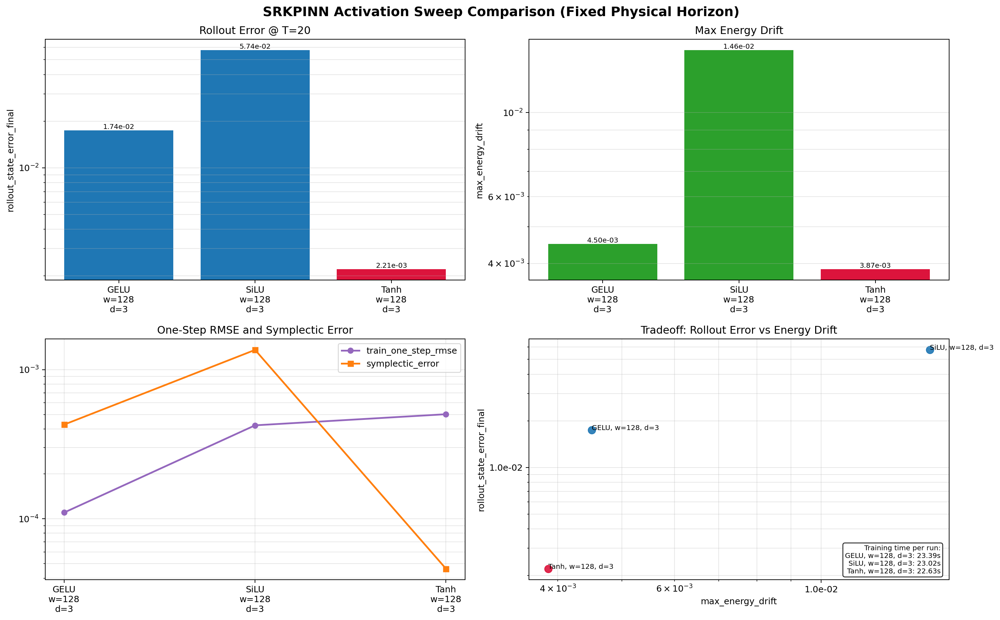

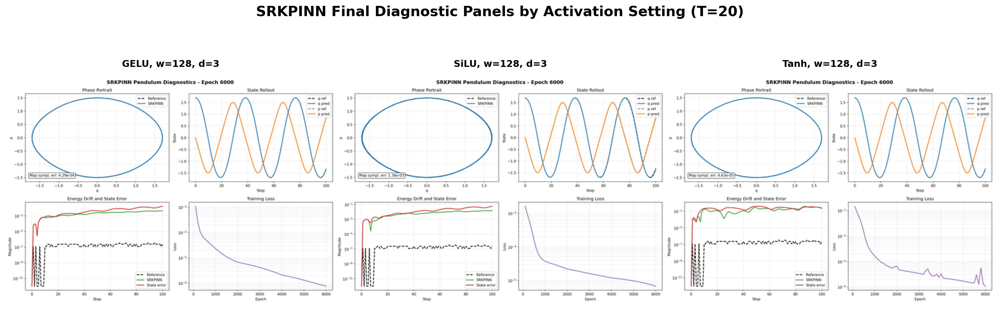

## 8. 最终最优配置与诊断

最终最优运行：`act_T20_lr_1em03_ep_6000_w_128_d_3_tanh`

### 8.1 最终最优配置

| 参数 | 值 |
| --- | --- |
| `dt` | `0.2` |
| `stages` | `3` |
| 方法 | `gauss-legendre` |
| `train_data_size` | `512` |
| `sample_mode` | `uniform` |
| 损失权重 | `StageDynamics=1.0`, `InitialOrData=2.0` |
| 网络层 | `[2, 128, 128, 128, 6]` |
| 激活函数 | `Tanh` |
| 学习率 | `1e-3` |
| 训练轮数 | `6000` |
| 调度器 | `MultiStepLR milestones=[2000,4000], gamma=0.5` |
| 评估 rollout | `100` 步, `T=20.0` |

### 8.2 最终最优指标

| 指标 | 值 |
| --- | ---: |
| 训练单步 RMSE | `5.028848e-04` |
| 监测单步 L2 | `1.151196e-04` |
| rollout 终端误差 | `2.214470e-03` |
| 最大 rollout 误差 | `4.014834e-03` |
| 终端能量漂移 | `2.409577e-03` |
| 最大能量漂移 | `3.867388e-03` |
| 辛误差 | `4.625320e-05` |
| 训练时间 | `22.63 s` |

### 8.3 最终最优诊断图


